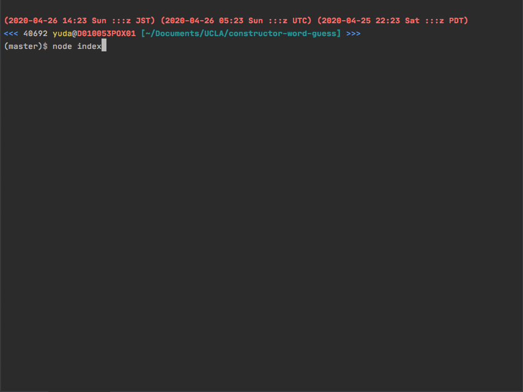

# Word Guess Game (Constructors)

### Overview
Word Guess command-line game using constructor functions.

### Links
- [Link to the code](https://github.com/yuda0110/constructor-word-guess)

### Tech/framework used

- JavaScript
- Node
- [Inquirer](https://www.npmjs.com/package/inquirer)

### How to use the app
1. Go to the root directory of the app.
2. Run `npm install` in the terminal.
3. Type in a command `node index`.

### Demo
